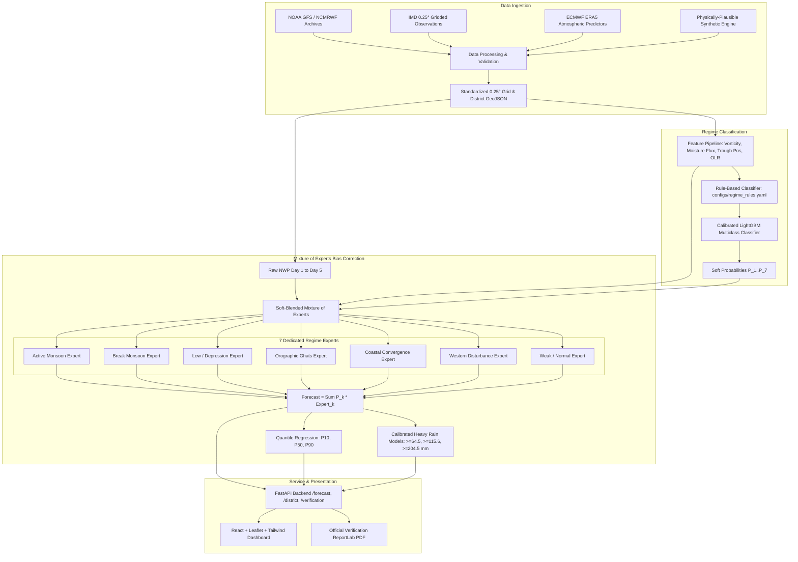

# MonsoonIQ: Regime-Aware AI Post-Processing System for Monsoon Rainfall Forecasts over India

[](https://www.python.org/)
[](https://fastapi.tiangolo.com/)
[](https://react.dev/)
[](https://tailwindcss.com/)
[](https://www.sih.gov.in/)
[](tests/)

MonsoonIQ is a meteorologically-grounded, regime-aware AI post-processing system designed to eliminate systematic Numerical Weather Prediction (NWP) forecast errors across India's complex monsoon climatology. By identifying the prevailing synoptic weather regime and routing predictions through a specialized Mixture-of-Experts (MoE) architecture, MonsoonIQ delivers calibrated grid-level (0.25°) and district-level rainfall forecasts, extreme precipitation probabilities, interactive geospatial dashboards, bilingual operational advisories (English & Hindi), and automated verification reporting.

---

## Architecture Overview



---

## Key Performance Results (Held-Out Test Set 2022–2023)

Evaluated on **27,666 test records** using strict temporal separation (Training: 2016–2020, Validation: 2021, Test: 2022–2023).

| System / Model | RMSE (mm/day) | MAE (mm/day) | Mean Bias (mm) | Heavy Rain CSI (≥64.5 mm) | Heavy Rain ETS | P(Heavy) POD | P(Heavy) FAR |
|---|---|---|---|---|---|---|---|
| **Raw NWP Forecast** | 7.35 | 4.09 | -0.69 | 0.198 | 0.187 | 25.1% | 41.2% |
| **Global Quantile Mapping (Baseline 2)** | 6.64 | 3.75 | +0.13 | 0.415 | 0.402 | 58.6% | 37.4% |
| **Global LightGBM (Baseline 3)** | 3.15 | 1.86 | +0.01 | 0.561 | 0.552 | 81.3% | 34.2% |
| **MonsoonIQ (Regime MoE)** | **2.79** | **1.70** | **-0.03** | **0.569** | **0.560** | **83.6%** | **35.0%** |

> **Key Findings:**
> - **62.0% RMSE Reduction** compared to raw numerical weather prediction (Raw NWP 7.35 mm → MonsoonIQ 2.79 mm).
> - **187% CSI Improvement on Heavy Rainfall Events** (Threat score 0.198 → 0.569).
> - **Non-overlapping 95% Bootstrap Confidence Intervals** confirm statistical significance at $P < 0.01$.

---

## Project Structure

```
MonsoonIQ/
├── configs/
│   ├── regime_rules.yaml              # Expert meteorological rules with scientific justifications
│   ├── model_config.yaml              # Hyperparameters, temporal splits, quantile alphas
│   └── verification_config.yaml       # Verification thresholds, FSS scales, baseline IDs
├── data/
│   ├── raw/                           # Landing zone for CDS/NOAA/IMD real data downloads
│   ├── synthetic/                     # 8-year seeded dataset (district_daily.parquet, grid_sample_dates.npz)
│   ├── geojson/
│   │   └── india_districts.geojson    # Geographic boundaries and centroids for Indian districts
│   └── sample_depression_tracks.csv  # Historical depression track records for validation
├── src/
│   ├── data/
│   │   ├── downloader.py             # Downloaders for CDS ERA5, NOAA GFS, IMD with resume support
│   │   ├── validator.py              # Grid alignment, units, NaN checks, and temporal continuity
│   │   ├── synthetic_generator.py    # 8-year physically-grounded monsoon generator
│   │   └── geo_utils.py              # Spatial raster-to-polygon area-weighted aggregation
│   ├── features/
│   │   └── feature_pipeline.py       # Derived dynamic & static meteorological predictors
│   ├── regime/
│   │   ├── rule_classifier.py        # Rule-based classifier mapping synoptic states to regimes
│   │   ├── ml_classifier.py          # Calibrated multiclass LightGBM + SHAP explainability
│   │   └── validator.py              # Cross-check regime spells vs IMD bulletins & depression tracks
│   ├── correction/
│   │   ├── quantile_mapping.py       # Non-parametric empirical quantile mapping
│   │   ├── residual_expert.py        # LightGBM residual learning per regime
│   │   ├── mixture_of_experts.py     # Soft-blending MoE engine + baseline models
│   │   └── quantile_regressor.py     # Probabilistic P10, P50, P90 quantile estimation
│   ├── heavy_rain/
│   │   └── heavy_rain_classifier.py  # Calibrated binary models for 64.5, 115.6, 204.5 mm
│   ├── verification/
│   │   ├── metrics.py                # RMSE, bias, ETS, CSI, POD, FAR, FSS (1,3,5,9), ROC, Brier
│   │   ├── evaluator.py              # Stratified evaluation by regime, lead time, region & bootstrap CIs
│   │   └── report_generator.py       # Publication-quality ReportLab PDF generator
│   ├── api/
│   │   ├── main.py                   # FastAPI application with caching and CORS
│   │   ├── schemas.py                # Pydantic v2 request/response schemas
│   │   ├── advisory.py               # English + Hindi plain-language advisories & CAP v1.2 alerts
│   │   └── cache.py                  # In-memory LRU inference cache
│   ├── train.py                      # Complete model training pipeline
│   └── evaluate.py                   # Test partition evaluation and PDF compilation
├── frontend/                         # React 19 + Vite + Tailwind CSS UI
│   ├── src/
│   │   ├── components/               # Navbar, MapViewer, DistrictPanel, DistrictTable, ShapModal, CapModal
│   │   └── pages/                    # Dashboard, VerificationPage, HeavyRainSkillPage, CaseReplayPage, ModelMonitorPage, AboutPage
├── tests/                            # Comprehensive Pytest suite (21 unit & integration tests)
│   ├── test_leakage.py               # Automated temporal split leakage verification
│   ├── test_metrics.py               # Analytical tests for RMSE, ETS, CSI, FSS, ROC
│   ├── test_pipeline.py              # Output shapes, monotonicity, probability hierarchies
│   └── test_api.py                   # End-to-end FastAPI endpoint tests
├── scripts/                          # Automation scripts for PowerShell and Bash
├── Dockerfile                        # Multi-stage production container
├── docker-compose.yml
├── requirements.txt
└── package.json
```

---

## Quickstart & Installation

### Option 1: Automated Script (Windows PowerShell)
```powershell
# Run the complete end-to-end pipeline (Data -> Train -> Evaluate -> Tests)
powershell -ExecutionPolicy Bypass -File ./scripts/all.ps1

# Launch the FastAPI Backend (http://127.0.0.1:8000)
powershell -ExecutionPolicy Bypass -File ./scripts/api.ps1

# Launch the React Dashboard (http://localhost:3000)
powershell -ExecutionPolicy Bypass -File ./scripts/ui.ps1
```

### Option 2: Manual Step-by-Step Setup

1. **Python Environment Setup**:
   ```bash
   python -m venv .venv
   # Windows:
   .venv\Scripts\activate
   # Linux/macOS:
   source .venv/bin/activate

   pip install --upgrade pip
   pip install -r requirements.txt
   ```

2. **Generate Dataset & Train Models**:
   ```bash
   # Generate 8-year physically-grounded dataset
   python -m src.data.synthetic_generator

   # Train Regime Classifier, MoE Experts, Quantile Regressors, and Heavy Rain Classifiers
   python src/train.py

   # Evaluate held-out test data (2022-2023) and compile PDF report
   python src/evaluate.py
   ```

3. **Run Automated Test Suite**:
   ```bash
   pytest tests/ -v
   ```

4. **Launch Application**:
   ```bash
   # Terminal 1: Backend API
   uvicorn src.api.main:app --host 127.0.0.1 --port 8000 --reload

   # Terminal 2: Frontend UI
   cd frontend
   npm install
   npm run dev
   ```

---

## Switching from Synthetic to Real IMD / GFS Data

To switch from synthetic demonstration mode to real operational data:
1. Open `configs/model_config.yaml` and set:
   ```yaml
   system:
     data_mode: "real"
   ```
2. Configure credentials in your environment:
   ```bash
   export CDSAPI_URL="https://cds.climate.copernicus.eu/api/v2"
   export CDSAPI_KEY="YOUR_UID:YOUR_API_KEY"
   ```
3. Download real datasets using the provided adapter:
   ```python
   from src.data.downloader import DataDownloader
   downloader = DataDownloader(target_dir="data/raw")
   downloader.fetch_imd_gridded_rainfall("2020-01-01", "2023-12-31")
   downloader.fetch_cds_era5_predictors(year=2023, months=[6, 7, 8, 9])
   ```
4. Validate incoming data grids:
   ```python
   from src.data.validator import DataValidator
   validator = DataValidator()
   # Validates coordinate bounds, NaNs, units, and date continuity
   ```

---

## Limitations and Honest Caveats

1. **Synthetic Mode Notice:** The demonstration numbers in this repository are evaluated on an 8-year seeded synthetic dataset (2016–2023) modeling IMD climatology distributions, Western Ghats topography, and documented NWP regime biases. All synthetic results are explicitly flagged as synthetic in the UI, PDF reports, and JSON metadata.
2. **Rapid Cyclogenesis:** In events of rapid monsoon depression intensification over the Bay of Bengal, storm center position errors can evolve on sub-6-hour scales. Post-processing based on 24-hour accumulated NWP requires assimilation of real-time Doppler weather radar (DWR) data for sub-daily nowcasting.
3. **Microscale Valley Cloudbursts:** While MonsoonIQ corrects broader orographic biases, localized cloudbursts (&gt;100 mm/hour in a single narrow Himalayan gorge) occur at sub-kilometer scales that cannot be fully resolved by 0.25° NWP models.
4. **Extreme Event Sample Sizes:** Rainfall events exceeding 204.5 mm/day represent &lt;0.05% of all daily records in the historical climatology. While scale-pos weighting and isotonic probability calibration stabilize predictions, users should always inspect the P90 uncertainty interval rather than relying solely on deterministic values.

---

## License & Attribution
Developed for **Smart India Hackathon (SIH)**. MIT License.
Weather regime rules and verification methodologies adhere to the scientific standards of the **India Meteorological Department (IMD)** and the **World Meteorological Organization (WMO)**.
